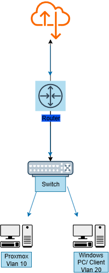

# ccna-homelab-network

## Overview
This project sets up a small-scale enterprise-style network using Cisco switches, a home router, and a Proxmox server.  
The goal is to practice CCNA-level networking skills while building a documented lab environment.

## Network Topology

- **Router** → Internet Gateway  
- **Switch (Cisco Catalyst 2960G-8)** → VLAN segmentation  
- **Proxmox PC** → Server/VM host  
- **Windows PC** → Client machine  

## Configuration Steps
- Erase old configs on switch  
- Set hostname  
- Configure VLANs  
- Assign ports to VLANs  
- Router-on-a-stick setup  

## Testing & Verification
- Ping tests across VLANs  
- Verify connectivity between Proxmox server and client PC  
- Document configs & results  

## Deliverables
- `README.md` (this file)  
- `topology.png` (network diagram)  
- `configs/` (switch & router configs)  
- `results/` (screenshots of pings, connectivity tests)

## Lessons Learned
